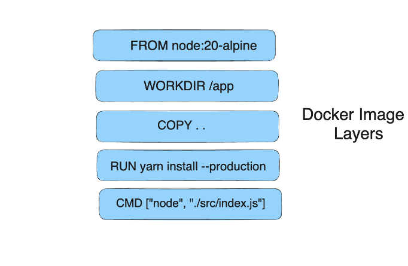
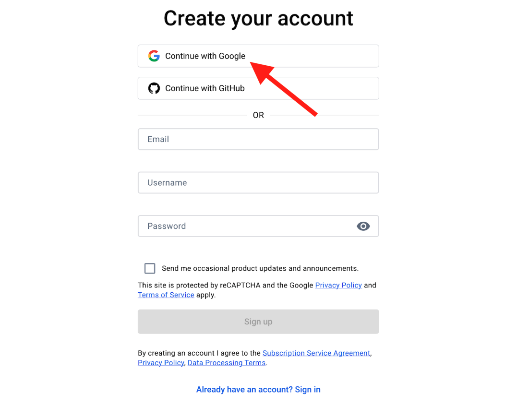
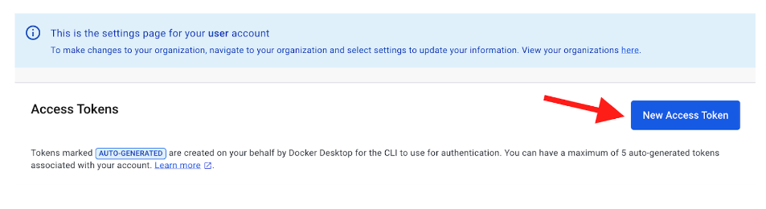

Now that we have created a Dockerfile, let's learn how to build a Docker Image and push a container registry.


Open your terminal window and run the following command to build a Docker image tagged as "node-app" from the Dockerfile located in the current directory (.).

```diff
 docker build -t node-app .
```


Here's a breakdown of the command:


* **docker build:** This command initiates the building of a Docker image.
* **-t node-app:** The -t flag is used to specify a tag for the image being built. In this case, the tag is "node-app", which allows for easier identification of the image.
* **The dot (.)** at the end of the command represents the build context. It indicates that the Dockerfile and any other resources needed for building the image are located in the current directory.

You might have noticed that a lot of "layers" were downloaded. This is because we instructed the builder that we wanted to start from the ``node:20-alpine`` image. But, since we didn't have that on our machine, that image needed to be downloaded.




After the image was downloaded, we copied in our application and used `yarn` to install our application's dependencies. The ``CMD`` directive specifies the default command to run when starting a container from this image.

Finally, the ``-t`` flag tags our image. Think of this simply as a human-readable name for the final image. Since we named the image ``node-app``, we can refer to that image when we run a container.

The ``.`` at the end of the ``docker build`` command tells that Docker should look for the ``Dockerfile`` in the current directory.


## Listing the Docker image

You can run ``docker images`` OR ``docker image ls`` command to list out the images.

```console
 docker image ls
 REPOSITORY                                 TAG       IMAGE ID       CREATED          SIZE
 node-app                                   latest    746c7e06537f   24 seconds ago   354MB
```


Here's what the output means:


* **REPOSITORY:** This column shows the name of the image repository. In your case, it's "node-app".
* **TAG:** This column shows the tag of the image. You have one image with the "latest" tag.
* **IMAGE ID**: This is a unique identifier for the image.
* **CREATED:** This column shows when the image was built. In your case, it was built 24 seconds ago.
* **SIZE:** This column shows the size of the image on disk. It's 354MB in this case.

You can see a single Docker image named "node-app" with the "latest" tag. It was recently built and occupies 354 MB of disk space.


## Publishing the Docker Image

## Step 1. Create a Docker Hub Account

Open [https://hub.docker.com/](https://hub.docker.com/) and click “Sign Up”


Authenticate via Google or GitHub based on your preference.



Once authenticated, you can sign-in with your Docker Hub account.

## Step 2.  Create a Repo

To push an image, we first need to create a repo on Docker Hub.

1. Go to [Docker Hub ](https://hub.docker.com)and log in if you need to.

2. Click the `Create Repository` button.

3. For the repo name, use ``node-app``. Make sure the Visibility is ``Public``.

4. Click the `Create` button!

If you look on the right-side of the page, you'll see a section named **`Docker commands`**. This gives

an example command that you will need to run to push to this repo.


## Step 3. Login to Docker Hub

Login to Docker Hub by either clicking on the "Sign In" button in Docker Desktop or using the command:




Please note that you will require a Personal Access Token(PAT)  to enter as a password. To create one, visit [https://hub.docker.com/settings/security](https://hub.docker.com/settings/security) and create a new token.

## Step 4. Tag your Docker Image

```console
 docker tag node-app your_dockerhub_username/node-app:1.0
```

## Step 5. Push your Docker Image

In the command line, try running the push command you see on Docker Hub. Note that your command will be using your Docker Hub ID/namespace, not "docker".

```console
  docker push <your_dockerhub_username>/node-app:1.0
```
## Recap

In this section, we learned how to share our images by pushing them to a registry. 



