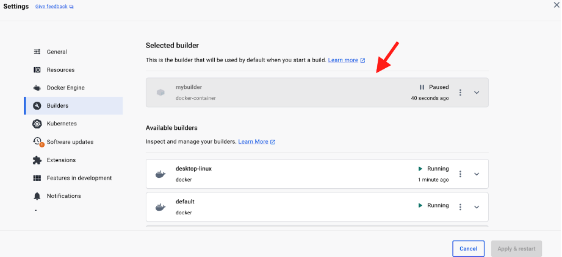

Traditionally, Docker images were tied to a specific architecture and operating system. However, with multi-platform support, a single Docker image can contain variants for different architectures and operating systems. This means that developers can build images that run seamlessly across diverse environments, from x86_64 machines to ARM-based devices, and even different operating systems like Windows.


### Building Multi-Platform Images

When building Docker images, developers can specify the target platform using the `--platform` flag. For example, you can build images for Linux on AMD64, ARM64, or other architectures. By default, Docker allows building for a single platform at a time. However, with advanced strategies, such as QEMU emulation or using multiple native nodes, developers can build for multiple platforms simultaneously.


### Strategies for Building Multi-Platform Images:

There are several strategies for building multi-platform Docker images, each with its own advantages and use cases:


* **QEMU Emulation:** This strategy leverages QEMU emulation support in the kernel to build multi-platform images. While easy to get started with, QEMU emulation can be slower than native builds, especially for compute-intensive tasks.
* **Multiple Native Nodes:** Building on multiple native nodes provides better support for complex scenarios that QEMU can't handle. By adding additional nodes to a builder, developers can achieve better performance and flexibility.
* **Cross-Compilation:** For projects with good support for cross-compilation, developers can use multi-stage builds in Dockerfiles to cross-compile binaries for different architectures. This approach utilizes native architecture of the build node and can be highly efficient.


### Limitations of local builds for multi-arch:


* **Limited resources:** Your local machine might not have sufficient resources (CPU, memory) to handle complex multi-arch builds efficiently, especially for multiple or high-resource architectures.
* **Inconsistent environment:** Building on your local machine might lead to inconsistencies due to varying software versions or missing tools compared to other developers' machines.
* **Manual scaling:** Scaling up local builds is impractical and resource-intensive.


### Choosing the right approach:

For simple multi-arch builds with limited complexity, building locally with Docker Buildx might be sufficient. However, for large, complex, or frequent multi-arch builds, utilizing Docker Cloud Build as a remote builder offers significant advantages in terms of speed, resource optimization, and consistency


### Using Docker Cloud Build as a remote Builder

[Docker Build Cloud](https://docs.docker.com/build/cloud/) is a service that lets you build your container images faster, locally as well as in CI. It was designed specifically to help developers in their inner loop where they don’t have to change workflows and have all of their tools that may not be accessible in CI. Builds run on cloud infrastructure optimally dimensioned for your workloads; no configuration required. The service uses a remote build cache, ensuring fast builds anywhere and for all team members.

Docker Cloud Build acts as both a remote and local builder depending on your specific choice and configuration. When you use Docker Cloud Build, your Dockerfile and context are uploaded to the cloud, and the actual build process occurs on remote computing resources managed by Docker. This is different from building locally on your own machine, where you have limited resources and potentially varying configurations. When it comes to building for multiple architectures with Docker, Docker Cloud Build can definitely act as a remote builder and offer specific advantages:


* **Multi-arch builds:** Docker Cloud Build allows you to simultaneously build your container image for different architectures (e.g., amd64, arm64) within a single build command. This eliminates the need to run separate builds for each architecture, saving you time and effort.
* **Remote builders with dedicated resources:** Unlike your local machine, Docker Cloud Build provides access to powerful remote builders with pre-installed compilers and tools specific to different architectures. This ensures consistent and optimized builds across all targets.
* **Scalability:** For large or complex builds, Docker Cloud Build can automatically scale up the resources allocated to your build, ensuring faster completion regardless of the architecture complexity.
* **Shared remote cache:** The shared remote cache in Docker Cloud Build can significantly accelerate multi-arch builds by reusing common layers across different architectures. This can be especially beneficial if your image has large base layers or shared dependencies.


### Getting Started

To get started with building multi-platform Docker images, developers can use tools like `docker buildx`, which provides support for multi-platform builds out of the box. By creating a new builder and specifying the target platforms, developers can seamlessly build, push, and run multi-platform images.

Consider the following Dockerfile:

```console
 FROM node:20-alpine
 WORKDIR /app
 COPY . .
 RUN yarn install --production
 CMD ["node", "./src/index.js"]
```

```console
 docker build -t node-app:1.0 .
```

## Create a Multi-Architecture Buildx Builder

Next, we'll create a multi-architecture builder using Docker Buildx. Run the following command:

```console 
 docker buildx create --name mybuilder --use
```


This command creates a new builder named `mybuilder` and sets it as the current builder.




## Build for Multiple Architectures


Now that we have a multi-architecture builder set up, we can build the Docker image for multiple architectures. Run the following command:

```console
 docker buildx build --platform linux/amd64,linux/arm64 -t my-node-app:1.0 --push .
```


This command builds the Docker image for both x86_64 and ARM64 architectures and tags it as my-node-app:multiarch. The --push flag pushes the built image to a container registry.

You can verify if the ``docker buildx build`` command is picking up the right builder with the first line of the output:

```console
 docker buildx build --platform linux/amd64,linux/arm64 -t node-app:1.0 --push .
[+] Building 18.2s (13/15)                                                                            docker-container:mybuilder
...
...
...
View build details: docker-desktop://dashboard/build/mybuilder/mybuilder0/z1ear72ovp81cf4rqmk0rrq22

Build multi-platform images faster with Docker Build Cloud: https://docs.docker.com/go/docker-build-cloud
```

### Verify Multi-Architecture Support

Finally, you can verify that the Docker image supports multiple architectures by inspecting its manifest:

```
 docker manifest inspect <your_dockerhub_id>/ node-app:1.0
```

```console
 {
   "schemaVersion": 2,
   "mediaType": "application/vnd.oci.image.index.v1+json",
   "manifests": [
      {
         "mediaType": "application/vnd.oci.image.manifest.v1+json",
         "size": 1626,
         "digest": "sha256:e5423cde978d7fbdc8c18da7786c0b468cd6076b728ba32ca9e9eb85222656c8",
         "platform": {
            "architecture": "amd64",
            "os": "linux"
         }
      },
      {
         "mediaType": "application/vnd.oci.image.manifest.v1+json",
         "size": 1626,
         "digest": "sha256:1bc05628be13b93d1731616b0701f66c88a25d822006f4e15bd22fded19ef7e6",
         "platform": {
            "architecture": "arm64",
            "os": "linux"
         }
      },
      {
         "mediaType": "application/vnd.oci.image.manifest.v1+json",
         "size": 566,
         "digest": "sha256:13bb853ae7e16476b49c2defade1825ccc21858c06c24019db9536876ee5cd94",
         "platform": {
            "architecture": "unknown",
            "os": "unknown"
         }
      },
      {
         "mediaType": "application/vnd.oci.image.manifest.v1+json",
         "size": 566,
         "digest": "sha256:95fdac652190e844fb8135d72869d57fff14da0184e274c1da7307bebfc036d5",
         "platform": {
            "architecture": "unknown",
            "os": "unknown"
         }
      }
   ]
}
```


