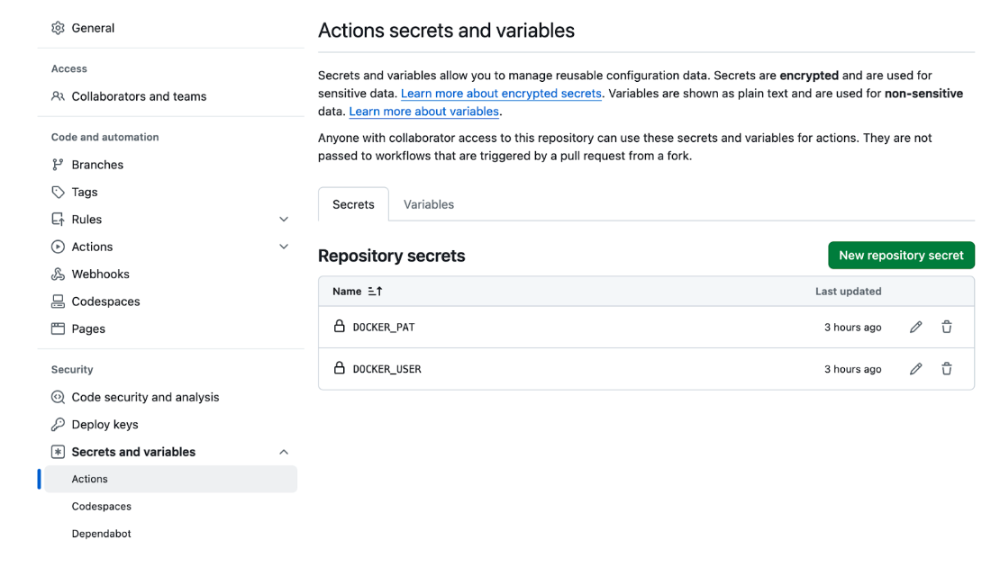
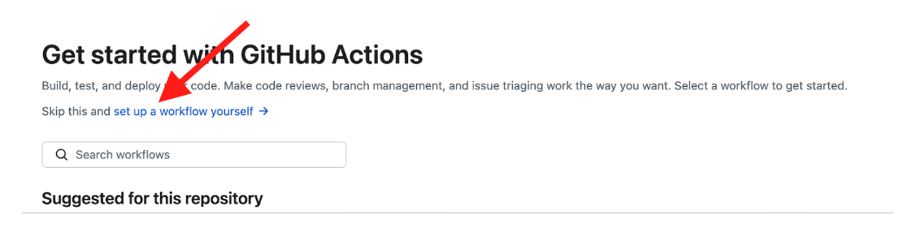
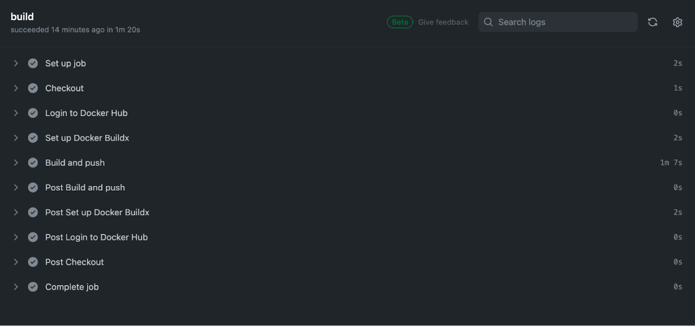

Before we jump into setting up and using GitHub Actions to build and test your Docker image, let’s spend time in understanding Docker Build Cloud.


### Quick Overview of Docker Build Cloud

Docker Build Cloud is a service that lets you build your container images faster, both locally and in CI. Builds run on cloud infrastructure optimally dimensioned for your workloads, no configuration required. The service uses a remote build cache, ensuring fast builds anywhere and for all team members.

[Using Docker Build Cloud in CI ](https://docs.docker.com/build/cloud/ci/)can speed up your build pipelines, which means less time spent waiting and context switching. You control your CI workflows as usual, and delegate the build execution to Docker Build Cloud.

Building with Docker Build Cloud in CI involves the following steps:


* Sign in to a Docker account.
* Set up Buildx and connect to the builder.
* Run the build.

When using Docker Build Cloud in CI, it's recommended that you push the result to a registry directly, rather than loading the image and then pushing it. Pushing directly speeds up your builds and avoids unnecessary file transfers.


### Getting Started with Docker Build Cloud

To get started with Docker Build Cloud, [create a Docker account](https://docs.docker.com/docker-id/) and sign up for the free plan on the [Docker Build Cloud Dashboard](https://build.docker.com/?_gl=1*16b5dz9*_ga*MTYxMTUxMzkzOS4xNjgzNTM0MTcw*_ga_XJWPQMJYHQ*MTcwNzIzNDgxMi42MTMuMS4xNzA3MjM2ODQzLjcuMC4w)

In this section, you'll learn how to set up and use GitHub Actions to build and test your Docker image as well as push it to Docker Hub. You will complete the following steps:


* Create a new repository on GitHub.
* Define the GitHub Actions workflow.
* Run the workflow


## Create the repository

Create a GitHub repository, configure the Docker Hub secrets, and push your source code.


1. Configuring the repository

Open the GitHub project repository` Settings`, and go to `Secrets and variables > Actions. `Create a new secret named `DOCKER_USER` and your Docker ID as value.



2. Create a new Personal Access Token (PAT) for Docker Hub

Add the PAT as a second secret in your GitHub repository, with the name` DOCKER_PAT`.


## Define the GitHub Actions workflow

Let’s follow the steps below to set up the GitHub Actions workflow for building, testing, and pushing the image to Docker Hub. 


1. Open [https://github.com/docker/getting-started-todo-app](https://github.com/docker/getting-started-todo-app) and click on “Actions”
2.  Click on the “set up a workflow yourself” link.



3. This creates an empty  .github/workflows directory in your project root.
4. Add the following content into the YAML file. You can name this file anything you like.

```console
 name: ci

on:
  push:
    branches:
      - "main"

jobs:
  docker:
    runs-on: ubuntu-latest
    steps:
      - name: Checkout
        uses: actions/checkout@v4
      - name: Log in to Docker Hub
        uses: docker/login-action@v3
        with:
          username: ${{ secrets.DOCKER_USER }}
          password: ${{ secrets.DOCKER_PAT }}
      - name: Set up Docker Buildx
        uses: docker/setup-buildx-action@v3
        with:
          version: "lab:latest"
          driver: cloud
          endpoint: "docker/devrel"
      - name: Build and push
        uses: docker/build-push-action@v5
        with:
          context: .
          tags: "IMAGE"
          # For pull requests, export results to the build cache.
          # Otherwise, push to a registry.
          outputs: ${{ github.event_name == 'pull_request' && 'type=cacheonly' || 'type=registry,push=true' }}
```

The following workflow automates the process of building and pushing a Docker image when code is pushed to the main branch of the repository. It uses Docker Hub for registry storage and leverages Docker Buildx for efficient multi-platform image building.

Here's a breakdown of the GitHub Actions workflow:


1. **Workflow Name:**

ci: This name suggests it's a continuous integration workflow, likely intended to build and test code changes as they're made.


2. **Triggers:**

on: push: The workflow will be triggered when code is pushed to the repository.

branches: - "main": It will specifically run when code is pushed to the main branch.


3. **Jobs:**

docker: This job contains the steps for building and pushing a Docker image.

runs-on: ubuntu-latest: The job will run on a virtual machine with the latest Ubuntu OS.


## Steps:


1. **Checkout:**
* uses: actions/checkout@v4: This step checks out the code from the repository to the virtual machine.
2. **Log in to Docker Hub:**
* uses: docker/login-action@v3: Logs in to Docker Hub using provided credentials.
* username: ${{ secrets.DOCKER_USER }}: Retrieves the username from a secret named DOCKER_USER.
* password: ${{ secrets.DOCKER_PAT }}: Retrieves the password from a secret named DOCKER_PAT.
3. **Setup Docker Buildx:**
* **uses: docker/setup-buildx-action@v3**: Sets up Docker Buildx for building multi-platform images.
* version: "lab:latest": Uses the latest experimental version of Buildx.
* driver: cloud: Uses a cloud-based builder for potentially faster builds.
* endpoint: "docker/devrel": Specifies a cloud builder endpoint from Docker DevRel.
4. **Build and push:**
* uses: docker/build-push-action@v5: Builds and pushes the Docker image.
* context: .: Uses the current directory as the build context.
* tags: "IMAGE": Tags the image with the tag "IMAGE" (presumably to be replaced with a specific tag).
* outputs: Conditionally exports build cache or pushes to a registry based on whether it's a pull request or not.


## Run the workflow

Save the workflow file and run the job.



When the workflow is complete, go to your repositories on Docker Hub.If you see the new repository in that list, it means the GitHub Actions successfully pushed the image to Docker Hub.


### Recap

In this section, you learned how to set up a GitHub Actions workflow for your Node.js application.



