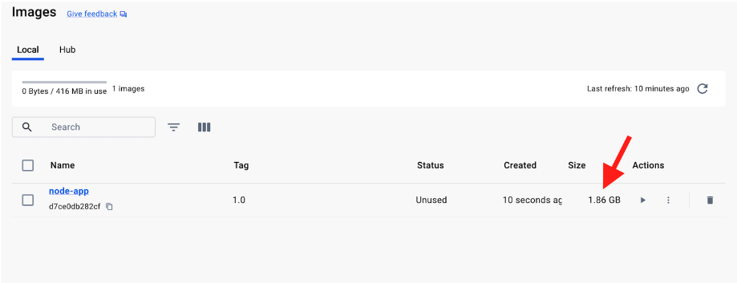
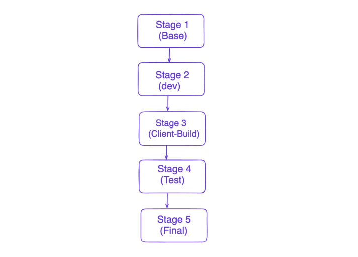

In the world of Docker, efficiency is key. Every byte counts, and every unnecessary layer in your image adds to its size and complexity. This is where multi-stage builds come into play, offering a powerful solution to streamline your Docker build process and produce leaner, more optimized images.

Multi-stage builds are a feature of Dockerfiles that allow you to define multiple build stages within a single Dockerfile. Each stage can be used to perform a specific task, such as compiling code, installing dependencies, or running tests. Once a stage is complete, you can copy only the necessary artifacts or files from that stage into subsequent stages, discarding any unnecessary build dependencies or intermediate files along the way. This results in a final image that contains only what is needed to run your application, without any extraneous baggage.


## The Benefits of Multi-Stage Builds

The advantages of multi-stage builds are numerous:


* **Reduced Image Size**: By eliminating unnecessary build dependencies and intermediate files, multi-stage builds result in smaller, more lightweight images. This not only saves disk space but also reduces network transfer times when pulling and pushing images.
* **Faster Builds: **With multi-stage builds, you can parallelize and optimize the build process, resulting in faster build times. By separating the build stages, you can take advantage of caching mechanisms to avoid re-executing unnecessary build steps, further speeding up the process.
* **Simplified Maintenance:** Multi-stage builds make it easier to maintain and update your Dockerfiles. By breaking down the build process into smaller, more manageable stages, you can isolate changes and updates to specific parts of your application, reducing the risk of introducing errors or regressions.
* **Improved Security:** By minimizing the size and complexity of your images, multi-stage builds reduce the attack surface and make it harder for attackers to exploit vulnerabilities in your applications or dependencies.

To demonstrate how Multi-Stage build can help you reduce your image size and expedite the build process, let’s consider the following Dockerfile:

```console
 FROM node:20
 WORKDIR /app
 COPY . .
 RUN yarn install --production
 CMD ["node", "./src/index.js"]
```


Save the file as “Dockerfile” and execute the following command:

```console
 docker build -t node-app:1.0
```
Let's verify the size of Docker image that we just built:



As shown in the Docker Dashboard, the complete Docker image size is 1.86GB.

Let’s streamline the build process by creating the following new Dockerfile:

```console
FROM node:20 AS base
WORKDIR /usr/local/app

FROM base AS dev
CMD ["yarn", "dev"]

FROM base AS client-build
COPY client/package.json client/yarn.lock ./
RUN --mount=type=cache,id=yarn,target=/root/.yarn yarn install
COPY client/.eslintrc.cjs client/index.html client/vite.config.js ./
COPY client/public ./public
COPY client/src ./src
RUN yarn build

FROM base AS test
COPY backend/package.json backend/yarn.lock ./
RUN --mount=type=cache,id=yarn,target=/root/.yarn yarn install --frozen-lockfile
COPY backend/spec ./spec
COPY backend/src ./src
RUN yarn test

FROM base AS final
ENV NODE_ENV=production
COPY --from=test /usr/local/app/package.json /usr/local/app/yarn.lock ./
RUN --mount=type=cache,id=yarn,target=/root/.yarn yarn install --production --frozen-lockfile
COPY backend/src ./src
COPY --from=client-build /usr/local/app/dist ./src/static
EXPOSE 3000
CMD ["node", "src/index.js"]
```


Let's break down the Dockerfile provided, which utilizes multi-stage builds:





1. Base Stage (base):
* This stage is based on the **node:20** image. It sets the working directory to /usr/local/app.
2. Development Stage (dev):
* Inherits from the base stage.
* Specifies the command to run when the container starts: yarn dev.
* This stage is designed for local development, so it expects files to be mounted into the container at runtime rather than being copied during build time.
3. Client Build Stage (client-build):
* Inherits from the base stage.
* Copies client/package.json and client/yarn.lock files into the container.
* Runs yarn install to install dependencies, utilizing a cache mount for efficient caching.
* Copies additional files required for building the client application: .eslintrc.cjs, index.html, vite.config.js, public, and src.
* Builds the client application using yarn build.
4. Test Stage (test):
* Inherits from the base stage.
* Copies backend/package.json and backend/yarn.lock files into the container.
* Runs yarn install --frozen-lockfile to install dependencies for running tests, utilizing a cache mount.
* Copies test files (backend/spec) and source code (backend/src) into the container.
* Executes tests using yarn test.
5. Final Stage (final):
* Inherits from the base stage.
* Sets the environment variable NODE_ENV to production.
* Copies package.json and yarn.lock files from the test stage into the container.
* Runs yarn install --production --frozen-lockfile to install production dependencies, utilizing a cache mount.
* Copies source code (backend/src) into the container.
* Copies the built client application (client-build stage) from /usr/local/app/dist to src/static.
* Exposes port 3000.
* Specifies the command to run when the container starts: node src/index.js.

Let’s save the file with a name “Dockerfile.multi” and execute the following build command:

```console
 docker build -t node-app:1.0 . -f Dockerfile.multi
```

That's a minor reduction in image size! In your original Dockerfile, all dependencies and files were copied into the image, resulting in a larger image size. However, with multi-stage builds, you can split the build process into smaller, more focused stages. 

If you're looking to further reduce the size of the image, you might consider the following optimizations:


* **Alpine Linux Base Image:** As mentioned earlier, using the Alpine Linux base image for Node.js can result in smaller image sizes compared to the regular Node.js image. This change alone could significantly reduce the size of your Docker image.
* **Dependency Minimization:** Review your project's dependencies and remove any that are not essential for running your application. This can help reduce the size of the final image by eliminating unnecessary packages.
* **Optimize Dockerfile Instructions: **Analyze your Dockerfile and look for opportunities to optimize instructions. Ensure that you're leveraging multi-stage builds effectively and minimizing the number of layers in your image.
* **Clean Up Intermediate Artifacts**: Ensure that your Dockerfile removes any unnecessary intermediate artifacts or files after each stage. This can help prevent unnecessary bloat in the final image.

By implementing these optimizations, you should be able to further reduce the size of your Docker image while maintaining the functionality of your application.

Let’s try to reduce the image size by replacing `node:20` with alpine-based Docker Images.

```console
 FROM node:20-alpine AS base
WORKDIR /usr/local/app

FROM base AS dev
CMD ["yarn", "dev"]

FROM base AS client-build
COPY client/package.json client/yarn.lock ./
RUN --mount=type=cache,id=yarn,target=/root/.yarn yarn install
COPY client/.eslintrc.cjs client/index.html client/vite.config.js ./
COPY client/public ./public
COPY client/src ./src
RUN yarn build

FROM base AS test
COPY backend/package.json backend/yarn.lock ./
RUN --mount=type=cache,id=yarn,target=/root/.yarn yarn install --frozen-lockfile
COPY backend/spec ./spec
COPY backend/src ./src
RUN yarn test

FROM base AS final
ENV NODE_ENV=production
COPY --from=test /usr/local/app/package.json /usr/local/app/yarn.lock ./
RUN --mount=type=cache,id=yarn,target=/root/.yarn yarn install --production --frozen-lockfile
COPY backend/src ./src
COPY --from=client-build /usr/local/app/dist ./src/static
EXPOSE 3000
CMD ["node", "src/index.js"]

```


In this Dockerfile, we've replaced `FROM node:20` with `FROM node:20-alpine` to use the Alpine Linux-based Node.js image. This change will result in a smaller Docker image size compared to the regular Node.js image. The rest of the Dockerfile remains the same, utilizing multi-stage builds to optimize the build process and reduce the size of the final image.

```console
 docker images
 REPOSITORY   TAG       IMAGE ID       CREATED         SIZE
 node-app     1.0       b33fa08b033f   6 seconds ago   352MB
```
By optimizing each stage and only including what is necessary, you were able to significantly reduce the overall image size while still achieving the same functionality. This not only improves performance but also makes your Docker images more lightweight and easier to manage. Multi-stage builds are indeed effective in optimizing Docker images by allowing you to separate the build process into distinct stages, each with its own purpose.


